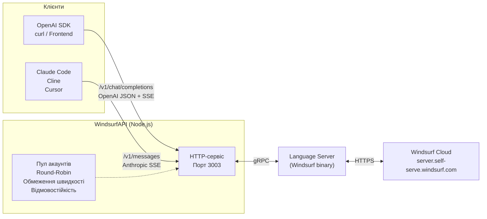
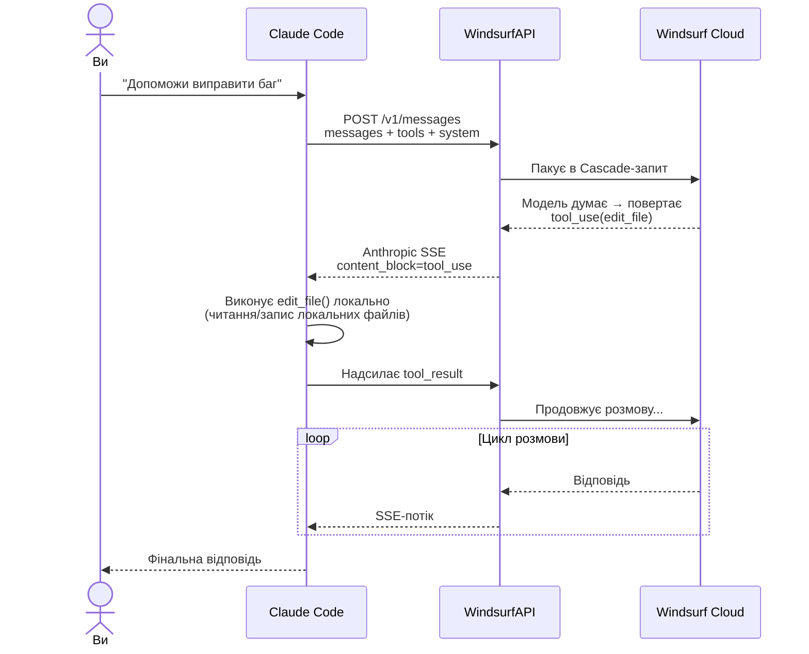

# Постав зірочку та підпишись — і я залишу тебе в спокої

<p align="center">
  <a href="https://github.com/MYMDO/WindsurfAPI/stargazers"></a>&nbsp;
  <a href="https://github.com/MYMDO"></a>
  &nbsp;·&nbsp;
  <a href="README.zh.md">中文/简体中文</a>&nbsp;
  <a href="README.en.md">English</a>
</p>

# Повідомлення

> **Якщо ви не поставили зірочку та не підписалися**: комерційне використання, перепродаж, платне розгортання, надання як публічного сервісу або перепродаж як транзитного сервісу суворо заборонено.
> **Якщо ви поставили зірочку та підписалися**: користуйтеся, я заплющу очі.
>
> Код поширюється за ліцензією MIT (див. [LICENSE](LICENSE)); вищезазначене є особистою позицією автора.

---

Перетворює AI-моделі [Windsurf](https://windsurf.com) (раніше Codeium) на **два стандартні сумісні API**:

- `POST /v1/chat/completions` — **OpenAI-сумісний** для будь-якого OpenAI SDK.
- `POST /v1/messages` — **Anthropic-сумісний** для прямого підключення Claude Code / Cline / Cursor.

**100+ моделей**: Claude 4.5/4.6/Opus 4.7 · GPT-5/5.1/5.2/5.4 серія · Gemini 2.5/3.0/3.1 · Grok · Qwen · Kimi K2.x · GLM 4.7/5/5.1 · MiniMax · SWE 1.5/1.6 · Arena та інші. Жодних npm-залежностей, чистий Node.js.

## Що це робить?



**Що він робить**:
1. HTTP-сервіс (порт 3003), який одночасно надає OpenAI та Anthropic API.
2. Перекладає запити у внутрішній gRPC-протокол Windsurf і надсилає їх у хмару Windsurf через локальний Language Server.
3. Керує пулом акаунтів з автоматичним round-robin, обмеженням швидкості та відмовостійкістю.
4. Видаляє ідентичність upstream Windsurf перед поверненням відповіді, змушуючи модель представлятися як "Я Claude Opus 4.6, розроблений Anthropic."

## Як використовувати з Claude Code / Cline / Cursor

Модель сама по собі **не** працює з файлами — файлові операції виконуються локально клієнтом IDE Agent (Claude Code, Cline тощо):



**Ключовий момент**: WindsurfAPI відповідає лише за **передачу** `tool_use` / `tool_result`. Файли насправді змінює клієнтський CLI.

## Швидкий старт

### Розгортання однією командою

```bash
git clone https://github.com/MYMDO/WindsurfAPI.git
cd WindsurfAPI
bash setup.sh          # Створення директорій · Встановлення прав · Генерація .env
node src/index.js
```

Dashboard: `http://YOUR_IP:3003/dashboard`

### Розгортання через Docker

```bash
cp .env.example .env

# Опціонально: розмістіть language_server_linux_x64 у .docker-data/opt/windsurf/
# Якщо пропустити, контейнер автоматично завантажить його під час першого запуску.

docker compose up -d --build
docker compose logs -f
```

Точки монтування за замовчуванням:

- `./.docker-data/data`: збережені `accounts.json`, `proxy.json`, `stats.json`, `runtime-config.json`, `model-access.json` та `logs/`
- `./.docker-data/opt/windsurf`: бінарний файл Language Server та його директорія даних
- `./.docker-data/tmp/windsurf-workspace`: тимчасова робоча директорія

Якщо ви хочете інше місце зберігання, встановіть `DATA_DIR` у `.env`. Docker-налаштування за замовчуванням використовує `/data`.

### Оновлення однією командою

Щоб отримати останні виправлення після розгортання, виконайте одну команду:

```bash
cd ~/WindsurfAPI && bash update.sh
```

`update.sh` робить: `git pull` → зупиняє PM2 → вбиває залишкові процеси на порту 3003 → перезапускає → перевірка здоров'я.

Якщо ви використовуєте наші публічні інстанси (`skiapi.dev` тощо), вам нічого не потрібно робити — ми вже застосували оновлення.

### Ручне встановлення

```bash
git clone https://github.com/MYMDO/WindsurfAPI.git
cd WindsurfAPI

# Бінарний файл Language Server — автоматичне визначення Linux/macOS, завантаження + chmod однією командою
bash install-ls.sh

# Шляхи встановлення за замовчуванням:
#   Linux x64:           /opt/windsurf/language_server_linux_x64
#   Linux arm64:         /opt/windsurf/language_server_linux_arm
#   macOS Apple Silicon: $HOME/.windsurf/language_server_macos_arm
#   macOS Intel:         $HOME/.windsurf/language_server_macos_x64

# Або використайте локальний бінарний файл:
#   bash install-ls.sh /path/to/language_server_linux_x64
# Або вкажіть власний URL:
#   bash install-ls.sh --url https://example.com/language_server_linux_x64

# ⚠️ Не бачите opus-4.7 / інші нові моделі?
# Публічний реліз Exafunction/codeium застряг на v2.12.5 (січень 2026)
# і не містить 4.7. Щоб отримати 4.7, скопіюйте бінарний файл LS
# з пакунку десктопного застосунку Windsurf:
#
#   macOS:   "$HOME/Library/Application Support/Windsurf/resources/app/extensions/windsurf/bin/language_server_macos_arm"
#   Linux:   "$HOME/.windsurf/bin/language_server_linux_x64"
#            або /opt/Windsurf/resources/app/extensions/windsurf/bin/language_server_linux_x64
#   Windows: %APPDATA%\Windsurf\bin\language_server_windows_x64.exe
#
#   # Встановлення з локальної копії:
#   bash install-ls.sh /path/to/language_server_linux_x64
#
# Після заміни /v1/models автоматично виявить новіший каталог із хмари.

cat > .env << 'EOF'
PORT=3003
API_KEY=
DEFAULT_MODEL=claude-4.5-sonnet-thinking
MAX_TOKENS=8192
LOG_LEVEL=info
LS_BINARY_PATH=/opt/windsurf/language_server_linux_x64
LS_DATA_DIR=/opt/windsurf/data
LS_PORT=42100
DASHBOARD_PASSWORD=
EOF

# Для локального запуску на macOS використовуйте LS_BINARY_PATH, який вивів install-ls.sh
# та встановіть LS_DATA_DIR на шлях, доступний для запису користувачем,
# наприклад /Users/you/.windsurf/data.

# Примітка: Inline-коментарі підтримуються в .env для значень без лапок:
#   PORT=3003  # Порт сервісу
# Значення в лапках зберігають все всередині лапок.

node src/index.js
```

## Критичні підводні камені (прочитайте обов'язково!)

### 1. model-access.json блокує ВСІ моделі
Файл `.docker-data/data/model-access.json` має три режими:
- `"all"` — без обмежень (**потрібний** для роботи)
- `"allowlist"` — лише моделі зі списку (порожній список = все заблоковано)
- `"blocklist"` — всі, крім заблокованих

**Симптом:** Будь-який запит повертає `403` з помилкою `模型 X 不在允許清單中`.

**Виправлення:**
```bash
curl -s -X PUT http://localhost:3003/dashboard/api/model-access \
  -H "X-Dashboard-Password: ваш_пароль" \
  -H "Content-Type: application/json" \
  -d '{"mode":"all","list":[]}'
```

**Захист від випадкової зміни:**
```bash
chmod 444 ./.docker-data/data/model-access.json
```

### 2. API_KEY обов'язковий при HOST=0.0.0.0
Якщо сервер слухає на `0.0.0.0` (а не `127.0.0.1`), він активує fail-closed режим — вимагає `Authorization: Bearer <API_KEY>` навіть якщо ви не планували захист. Обов'язково встановіть `API_KEY=something` у `.env`.

### 3. Free-акаунт майже безкорисний для Claude Code / OpenCode
Безкоштовний Windsurf дає доступ лише до `gemini-2.5-flash`, `glm-4.7/5/5.1`, `kimi-k2/k2.5` та аналогічних моделей. Ці моделі **не підтримують інструменти** (читання/запис файлів, виконання команд). OpenCode надсилає 12 інструментів — free-tier їх відхиляє.

**Pro tier** — єдиний варіант для повноцінної роботи з інструментами. Дає 113+ моделей з повною підтримкою.

## Додавання акаунтів

Після запуску сервісу необхідно додати акаунти Windsurf. Є три способи:

**Спосіб 1: Dashboard — один клік (рекомендовано)**

Відкрийте `http://YOUR_IP:3003/dashboard` → Увійдіть, щоб отримати токен → Натисніть **Sign in with Google** або **Sign in with GitHub** (OAuth-спливаюче вікно) або введіть email/пароль безпосередньо. Всі методи автоматично додадуть акаунт до пулу.

**Спосіб 2: Токен (працює з будь-яким методом входу)**

Перейдіть на [windsurf.com/show-auth-token](https://windsurf.com/show-auth-token), щоб скопіювати токен:

```bash
curl -X POST http://localhost:3003/auth/login \
  -H "Content-Type: application/json" \
  -d '{"token": "YOUR_TOKEN"}'
```

Після додавання зачекайте ~15 секунд на визначення тарифу, потім викличте probe:

```bash
# Отримайте ID акаунта:
curl http://localhost:3003/dashboard/api/accounts -H "X-Dashboard-Password: ваш_пароль"

# Запустіть probe:
curl -X POST http://localhost:3003/dashboard/api/accounts/$ID/probe \
  -H "X-Dashboard-Password: ваш_пароль"
```

**Спосіб 3: Пакетне додавання**

```bash
curl -X POST http://localhost:3003/auth/login \
  -H "Content-Type: application/json" \
  -d '{"accounts": [{"token": "t1"}, {"token": "t2"}]}'
```

## Приклади використання

### OpenAI формат (Python / JS / curl)

```python
from openai import OpenAI
client = OpenAI(base_url="http://YOUR_IP:3003/v1", api_key="YOUR_API_KEY")
r = client.chat.completions.create(
    model="claude-sonnet-4.6",
    messages=[{"role": "user", "content": "Привіт"}]
)
print(r.choices[0].message.content)
```

### Anthropic формат (безпосередньо з Claude Code)

```bash
export ANTHROPIC_BASE_URL=http://YOUR_IP:3003
export ANTHROPIC_API_KEY=YOUR_API_KEY
claude                # Використовуйте Claude Code як зазвичай
```

```bash
# Прямий тест через curl
curl http://localhost:3003/v1/messages \
  -H "Authorization: Bearer YOUR_KEY" \
  -H "anthropic-version: 2023-06-01" \
  -d '{"model":"claude-opus-4.6","max_tokens":100,"messages":[{"role":"user","content":"Привіт"}]}'
```

### Cline / Cursor / Aider

У налаштуваннях вашого клієнта для **Custom OpenAI Compatible**:
- Base URL: `http://YOUR_IP:3003/v1`
- API Key: YOUR_API_KEY
- Model: Виберіть будь-яку підтримувану модель.

> **Користувачі Cursor**: Cursor's клієнтський білий список блокує назви моделей, що містять `claude` (запит ніколи не досягає сервера). Використовуйте ці псевдоніми:
>
> | Введіть у Cursor | Фактична модель |
> |---|---|
> | `opus-4.6` | claude-opus-4.6 |
> | `sonnet-4.6` | claude-sonnet-4.6 |
> | `opus-4.7` | claude-opus-4-7-medium |
> | `ws-opus` | claude-opus-4.6 |
> | `ws-sonnet` | claude-sonnet-4.6 |
>
> GPT / Gemini / DeepSeek моделі не підпадають під фільтр Cursor — використовуйте їх оригінальні назви.

### OpenCode інтеграція

Створіть `opencode.json` у корені вашого проєкту:

```jsonc
{
  "model": "windsurf/claude-sonnet-4.6",
  "small_model": "windsurf/claude-4.5-haiku",
  "provider": {
    "windsurf": {
      "npm": "@ai-sdk/openai-compatible",
      "name": "Windsurf API",
      "options": {
        "baseURL": "http://localhost:3003/v1",
        "apiKey": "local-dev-key"
      },
      "models": {
        "claude-sonnet-4.6":           { "name": "Claude Sonnet 4.6" },
        "claude-sonnet-4.6-thinking":  { "name": "Claude Sonnet 4.6 Thinking" },
        "claude-sonnet-4.6-1m":        { "name": "Claude Sonnet 4.6 (1M контекст)" },
        "claude-4.5-haiku":            { "name": "Claude 4.5 Haiku" },
        "claude-opus-4.6":             { "name": "Claude Opus 4.6" },
        "claude-opus-4-7-max":         { "name": "Claude Opus 4.7 Max" },
        "gpt-5-codex":                 { "name": "GPT-5 Codex" },
        "gemini-2.5-pro":              { "name": "Gemini 2.5 Pro" },
        "grok-3":                      { "name": "Grok 3" },
        "kimi-k2":                     { "name": "Kimi K2" }
      }
    }
  }
}
```

## Змінні середовища

| Змінна | За замовчуванням | Опис |
|---|---|---|
| `PORT` | `3003` | Порт сервісу |
| `API_KEY` | пусто | Ключ API для запитів. Залиште порожнім, щоб вимкнути валідацію. |
| `DATA_DIR` | корінь проєкту | Директорія для збережених JSON-станів та `logs/`. Для Docker зазвичай використовуйте `/data`. |
| `CODEIUM_API_KEY` | пусто | Прямий ключ API від Windsurf (альтернатива токену). |
| `CODEIUM_AUTH_TOKEN` | пусто | Токен з [windsurf.com/show-auth-token](https://windsurf.com/show-auth-token). |
| `CODEIUM_EMAIL` | пусто | Email для аутентифікації акаунта Windsurf. |
| `CODEIUM_PASSWORD` | пусто | Пароль для аутентифікації акаунта Windsurf. |
| `CODEIUM_API_URL` | `https://server.self-serve.windsurf.com` | URL API хмари Windsurf. |
| `DEFAULT_MODEL` | `claude-4.5-sonnet-thinking` | Модель, що використовується, якщо `model` не вказано. |
| `MAX_TOKENS` | `8192` | Максимальна кількість токенів у відповіді. |
| `LOG_LEVEL` | `info` | debug / info / warn / error |
| `LS_BINARY_PATH` | `/opt/windsurf/language_server_linux_x64` | Шлях до бінарного файлу LS. |
| `LS_PORT` | `42100` | gRPC порт LS. |
| `LS_DATA_DIR` | Linux: `/opt/windsurf/data`; macOS: `~/.windsurf/data` | Коренева директорія даних LS для кожного проксі. |
| `DASHBOARD_PASSWORD` | пусто | Пароль Dashboard. Залиште порожнім для доступу без пароля. |
| `ALLOW_PRIVATE_PROXY_HOSTS` | пусто | Встановіть `1`, щоб дозволити приватні/внутрішні IP (напр., `192.168.x.x`, `10.x.x.x`) у тестах проксі та логіні. Залиште порожнім, щоб дозволити лише публічні адреси (за замовчуванням). |
| `CASCADE_REUSE_STRICT` | `0` | Встановіть `1` для суворого режиму повторного використання розмови (очікує той самий відбиток). |
| `CASCADE_REUSE_STRICT_RETRY_MS` | `60000` | Затримка повторної спроби в мс для суворого режиму. |
| `CASCADE_REUSE_HASH_SYSTEM` | `0` | Встановіть `1`, щоб включати системні повідомлення в хеш повторного використання розмови. |

## Можливості Dashboard

Відкрийте `http://YOUR_IP:3003/dashboard`:

| Панель | Можливості |
|---|---|
| **Огляд** | Стан системи · Пул акаунтів · Здоров'я LS · Рівень успішності |
| **Вхід / Отримати токен** | Google / GitHub OAuth вхід одним кліком · Вхід за email/паролем · **Кнопка "Test Proxy"** (тестує вихідну IP) |
| **Керування акаунтами** | Додати / Видалити / Вимкнути · Визначити рівень підписки · Перевірити баланс · Заблокувати моделі через чорний список |
| **Керування моделями** | Глобальний білий/чорний список моделей |
| **Налаштування проксі** | Глобальний або периакаунтний HTTP / SOCKS5 проксі |
| **Логи** | SSE-потік у реальному часі · Фільтр за рівнем · `turns=N chars=M` діагностика |
| **Статистика** | Часовий діапазон 6год / 24год / 72год · Деталізація за акаунтами · p50 / p95 затримки |
| **Експериментальне** | Cascade conversation reuse · **Model Identity Injection** |

## Підтримувані моделі

100+ статичних моделей в основному каталозі плюс динамічні хмарні моделі, додані під час запуску через `mergeCloudModels`. Повний список: `GET /v1/models`, або перегляньте [каталог моделей на GitHub Pages](https://dwgx.github.io/WindsurfAPI/#models) (автоматично генерується з `src/models.js`).

<details>
<summary><b>Claude (Anthropic)</b> — 21 модель</summary>

claude-3.5-sonnet / 3.7-sonnet / thinking · claude-4-sonnet / opus / thinking · claude-4.1-opus · claude-4.5-haiku / sonnet / opus · claude-sonnet-4.6 (вкл. 1m / thinking / thinking-1m) · claude-opus-4.6 / thinking · **claude-opus-4.7-medium**

</details>

<details>
<summary><b>GPT (OpenAI)</b> — 55 моделей</summary>

gpt-4o · gpt-4.1 · gpt-5 серія (вкл. medium / high / codex) · **gpt-5.1 серія** (base / low / medium / high + fast + codex, всі 6 варіантів) · **gpt-5.2 серія** (none / low / medium / high / xhigh + fast + codex) · **gpt-5.4 серія** (base / mini × low/medium/high/xhigh) · o3 серія (base / mini / pro) · o4-mini

</details>

<details>
<summary><b>Gemini (Google)</b> — 9 моделей</summary>

gemini-2.5-pro / flash · gemini-3.0-pro / flash (minimal / low / medium / high — 4 рівні міркувань) · gemini-3.1-pro (low / high)

</details>

<details>
<summary><b>Відкриті / китайські провайдери</b></summary>

**Kimi**: kimi-k2 / k2.5 / k2-6 · **GLM**: glm-4.7 / 5 / 5.1 · **Qwen**: qwen-3 · **Grok**: grok-3 / grok-3-mini-thinking / grok-code-fast-1 · **MiniMax**: minimax-m2.5

</details>

<details>
<summary><b>Windsurf власні + Arena</b></summary>

swe-1.5 / 1.5-fast / 1.6 / 1.6-fast · arena-fast · arena-smart

</details>

> **Доступні моделі для безкоштовних акаунтів** зазвичай включають `gemini-2.5-flash`, `glm-4.7` / `glm-5` / `5.1`, `kimi-k2` / `k2.5` / `k2-6`, `qwen-3` тощо; сімейство Claude, GPT та Opus / thinking варіанти потребують Pro. Точний список кожного акаунта відображається в Dashboard.
>
> **Надійність викликів інструментів (виміряно v2.0.82+):** Сімейство Claude найнадійніше; GLM-4.7 / Kimi-K2.5 працюють у більшості випадків; GLM-5.1 ненадійний на cascade-бекенді; GPT також обмежений. Для Claude Code / Cline / Codex рекомендовано `claude-haiku-4.5` або `claude-sonnet-4.6`.

### Мовна підтримка

Сервіс автоматично визначає китайські, японські або корейські символи у ваших повідомленнях і додає підказку для відповіді тією самою мовою. Українська мова передається як звичайний текст — моделі відповідають мовою запиту.

## Архітектурні особливості

- **Zero npm-залежностей** Все використовує вбудовані модулі `node:*` · Protobuf створений вручну (`src/proto.js`) · Завантажте та запускайте.
- **Пул акаунтів + Пул LS** Кожен незалежний проксі отримує власний LS-інстанс, без змішування.
- **NO_TOOL Mode** `planner_mode=3` вимикає вбудований цикл інструментів Cascade.
- **Трирівнева санітизація** Фільтрація результатів інструментів LS · Парсинг тексту `<tool_call>` · Очищення вихідних шляхів.
- **Реальний підрахунок токенів** Отримує справжні `inputTokens` / `outputTokens` / `cacheRead` / `cacheWrite` з `CortexStepMetadata.model_usage`.

## Розгортання через PM2

```bash
npm install -g pm2
pm2 start src/index.js --name windsurf-api
pm2 save && pm2 startup
```

**Не використовуйте** `pm2 restart` (може створити zombie-процеси). Використовуйте скрипт оновлення `bash update.sh`.

## Фаєрвол

```bash
# Ubuntu
ufw allow 3003/tcp

# CentOS
firewall-cmd --add-port=3003/tcp --permanent && firewall-cmd --reload
```

Не забудьте відкрити порт 3003 у групі безпеки вашого хмарного провайдера.

## Поширені запитання

**П: Вхід не вдається з помилкою "Invalid email or password"**
В: Ймовірно, ви зареєструвалися у Windsurf через Google/GitHub, що означає, що ваш акаунт не має пароля. Панель Dashboard тепер безпосередньо підтримує вхід одним кліком через Google/GitHub OAuth.

**П: Модель каже "I cannot operate on the file system"**
В: Це **чат-API**, а не IDE-агент. Щоб модель могла змінювати файли, використовуйте клієнтський CLI як **Claude Code / Cline / Cursor / Aider** і вкажіть URL API цього сервісу. Модель буде генерувати `tool_use`, клієнт виконає його локально та надішле `tool_result` назад. Діаграма вище показує детальний потік.

**П: Контекст втрачається / Модель забуває попередні частини розмови**
В: Round-robin між акаунтами **не** втрачає контекст — кожен запит перепаковує повну історію та надсилає її до Cascade. Справжня причина зазвичай у проміжному шарі (наприклад, new-api), який не передає повний масив `messages[]`. Перевірте `turns=N` у логах Dashboard: якщо це багатообертова розмова, але `turns=1`, значить шар перед вами вже відкинув історію.

**П: Довгі запити вичерпують час**
В: Це виправлено. Виявлення холодного зависання тепер адаптивне до довжини введення, з максимальним таймаутом 90 секунд для довгих введень.

**П: Чи можна використовувати Claude Code?**
В: Так. `export ANTHROPIC_BASE_URL=http://YOUR_API` + `export ANTHROPIC_API_KEY=YOUR_KEY`. `/v1/messages` підтримує повний набір: system, tools, tool_use, tool_result, stream та багатообертові розмови — все протестовано та працює.

**П: Які моделі доступні безкоштовним акаунтам?**
В: Переважно `gemini-2.5-flash`, `glm-4.7` / `5` / `5.1`, `kimi-k2` / `k2.5` / `k2-6`, `qwen-3` (відкриті моделі). Сімейство Claude, GPT та Opus / Max / -thinking варіанти потребують Pro. Dashboard показує список доступних моделей для кожного акаунта.

**П: Чи надійні виклики інструментів на безкоштовних акаунтах?**
В: Залежить від моделі. Сімейство Claude найнадійніше. GLM-4.7 / Kimi-K2.5 працюють у більшості випадків. GLM-5.1 ненадійний на cascade-бекенді — проксі не може це виправити. **Для Claude Code / Cline / Codex рекомендовано `claude-haiku-4.5` або `claude-sonnet-4.6`.**

**П: 31 пробний акаунт стають недоступними після кількох сотень викликів**
В: Ймовірно, модель використовує тижневу квоту — `claude-opus-4-7-max` / `gpt-5.5-xhigh` / `claude-sonnet-4-7-thinking` тощо обмежені до 5 викликів на тиждень на акаунт. Перейдіть на `claude-sonnet-4.6` / `claude-haiku-4.5` (денні квоти значно більші).

## Контриб'ютори

Величезна подяка наступним людям, які надіслали pull request'и або систематично аудитували код:

- [@dd373156](https://github.com/dd373156) — [PR #1](https://github.com/dwgx/WindsurfAPI/pull/1)
  Виправлення логіки об'єднання моделей Pro-рівня.
- [@colin1112a](https://github.com/colin1112a) — [PR #13](https://github.com/dwgx/WindsurfAPI/pull/13)
  Аудит безпеки: 15 виявлених помилок безпеки/конкуренції/ресурсів.
- [@baily-zhang](https://github.com/baily-zhang) — [PR #36](https://github.com/dwgx/WindsurfAPI/pull/36) + [PR #45](https://github.com/dwgx/WindsurfAPI/pull/45)
  Виправлення Cascade conversation reuse.
- [@aict666](https://github.com/aict666) — [PR #44](https://github.com/dwgx/WindsurfAPI/pull/44)
  Виправлення inferTier.
- [@smeinecke](https://github.com/smeinecke) — [PR #43](https://github.com/dwgx/WindsurfAPI/pull/43)
  Повна інтернаціоналізація Dashboard: 14 комітів, китайські/англійські переклади, I18n-система, check-i18n.js.

Бажаєте бути в цьому списку? Відкрийте [issue](https://github.com/dwgx/WindsurfAPI/issues) або [pull request](https://github.com/dwgx/WindsurfAPI/pulls). У Dashboard є панель Credits ліворуч, яка показує ту саму інформацію.

## Ліцензія

MIT
